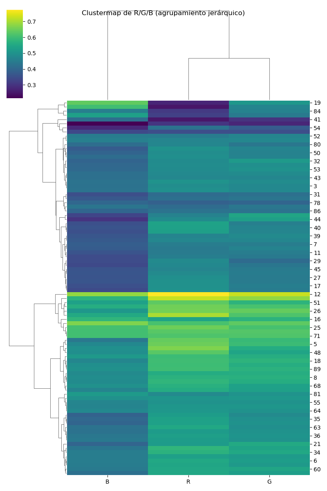
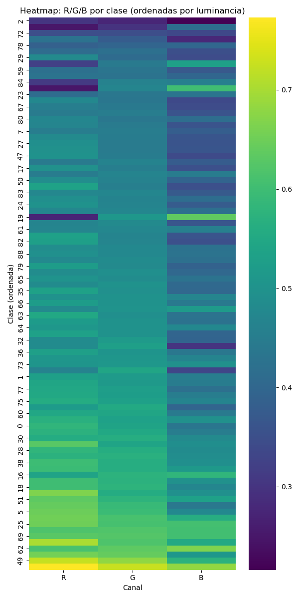

# Practice 2 report

## Data visualization

### Cluster map

### Color averages

### Heatmap by class

## Model Evaluation Report

The following metrics were obtained on the validation set (20% of the data) after re-training for 3 epochs a VGG16 model on the entire training set (60% of the data).

### Confusion Matrix

It looks like a series of classes in the middle (between 49 and 63) are being predicted more than they should be. These include [mosquito, moth, mouse, octopus, okapi, orangutan, otter, owl, ox, oyster, panda, parrot, pelecaniformes, penguin, pig]. The animals don't have much in common so the reason is not clear yet. Outside of this range, confusions are more disperse and less frequent.

### Calibration Plot

The model seems to be underconfident/pessimistic for the most part.

*Important: the evaluation plots were from a model trained with a very reduced image size (64x64 compared to 224x224 for the previous practice. We will fix and update it for the next one)*